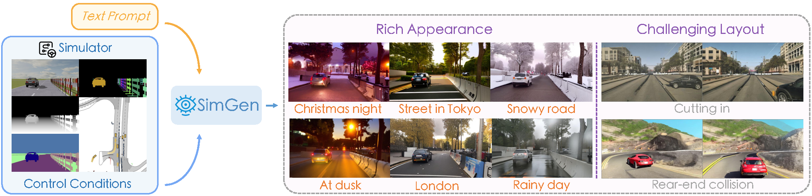
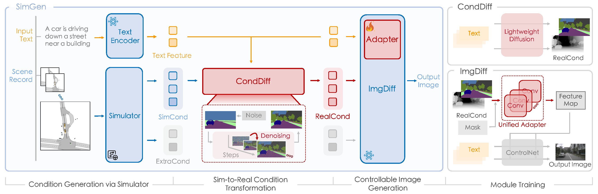
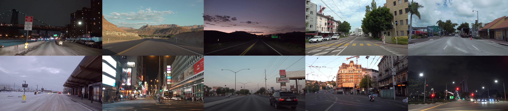

<div id="top" align="center">

# SimGen: Simulator-conditioned Driving Scene Generation

**Revive driving scene simulation by simulator-conditioned generative models**


<a href="https://metadriverse.github.io/simgen/"></a>
<a href="https://arxiv.org/abs/2406.09386">"></a>
<a href="README.md"></a>
<a href="#license-and-citation"></a>




</div>

>
> [Yunsong Zhou](https://zhouyunsong-sjtu.github.io/), Michael Simon, [Zhenghao Peng](https://pengzhenghao.github.io/), [Sicheng Mo](https://sichengmo.github.io/), Hongzi Zhu, Minyi Guo, and [Bolei Zhou](https://boleizhou.github.io/)
> 
> - Presented by [MetaDriverse](https://metadriverse.github.io/), [GenForce](https://genforce.github.io/), and Shanghai Jiao Tong University
> - :mailbox_with_mail: Primary contact: [Yunsong Zhou]((https://zhouyunsong-sjtu.github.io/)) ( zhouyunsong2017@gmail.com ) 
> - [arXiv paper](https://arxiv.org/abs/2406.09386) | [Blog TODO]() | [Slides](https://docs.google.com/presentation/d/1X1nB9umPlWtNfuUjZObO6UNyyBUbgHogVJA4bCaMiKQ/edit?usp=sharing)


## Highlights <a name="highlights"></a>

:fire: The first **simulator-conditioned generative model** for controllable driving scene generation with `appearance` and `layout` diversity. 

:star2: **SimGen** addresses simulation to reality `(Sim2Real)` gaps via cascade diffusion paradigm, and follows layout guidance from simulators and cues of the rich text prompts to realistic driving scenarios.



:bar_chart: **DIVA dataset** comprises 147.5 hours of `web videos` and `synthesized data` for diverse scene generation and advancing Sim2Real research.


## News <a name="news"></a>


- `[2024/06]` SimGem [paper](https://arxiv.org/abs/2406.09386) released.
- `[2024/06]` DIVA dataset subset released.


## Table of Contents

1. [Highlights](#highlights)
2. [News](#news)
3. [TODO List](#todo)
5. [DIVA Dataset](#dataset)
7. [License and Citation](#license-and-citation)
8. [Related Resources](#resources)

## TODO List <a name="todo"></a>

- [x] Release DIVA dataset
- [ ] Release SimGen code
- [ ] Toolkits for novel scene generation


## DIVA Dataset <a name="dataset"></a>




**DIVA-Real.** 
It collects driving videos from YouTube, covering a worldwide range of geography, weather, scenes, and traffic elements and preserving the appearance diversity of a wide range of traffic participants. Here we provide a sample of 🔗 [YouTube video list](https://docs.google.com/spreadsheets/d/1lKfd0iARpJl-5K37XSXRwiZIWi1LrTvL/edit?usp=sharing&ouid=102597623866661259117&rtpof=true&sd=true) we used.
For privacy considerations, we are temporarily keeping the complete data labels private.


**DIVA-Sim.** 
The Sim2Real data is induced from the same real-world scenarios, in which we can obtain real-world map topology, layout, and raw sensor data.
It also includes hazardous driving behaviors through interactions introduced by adversarial traffic generation.
The digital twins (on nuScenes dataset) and safety-critical scenarios (on Waymo Open dataset) can be obtained through this 🔗[data link](https://drive.google.com/drive/folders/1K7NrujRlfyI6VrH6Kd9kTHCeKnpl4bab?usp=sharing). 


## License and Citation

All assets and code in this repository are under the [Apache 2.0 license](./LICENSE) unless specified otherwise. The annotation data is under [CC BY-NC-SA 4.0](https://creativecommons.org/licenses/by-nc-sa/4.0/). Other datasets (including nuScenes, Waymo, and MetaDrive) inherit their own distribution licenses. Please consider citing our paper and project if they help your research.

```BibTeX
@article{zhou2024simgen,
  title={SimGen: Simulator-conditioned Driving Scene Generation},
  author={Zhou, Yunsong and Simon, Michael and Peng, Zhenghao and Mo, Sicheng and Zhu, Hongzi and Guo, Minyi and Zhou, Bolei},
  journal={arXiv preprint arXiv:2406.09386},
  year={2024}
}
```

## Related Resources <a name="resources"></a>

We acknowledge all the open-source contributors for the following projects to make this work possible:

- [Uni-ControlNet](https://github.com/ShihaoZhaoZSH/Uni-ControlNet) | [MetaDrive](https://github.com/metadriverse/metadrive)

You are welcome to follow other related work from <a href="https://twitter.com/Yunsong_Zhou" target="_blank"></a>, [MetaDriverse](https://metadriverse.github.io/), and [GenForce](https://genforce.github.io/).

- [ELM](https://github.com/OpenDriveLab/ELM) | [OpenScene](https://github.com/OpenDriveLab/OpenScene) | [DriveAGI](https://github.com/OpenDriveLab/DriveAGI)
- [ScenarioNet](https://github.com/metadriverse/scenarionet) | [CAT](https://github.com/metadriverse/cat) | [FreeControl](https://github.com/genforce/freecontrol)

